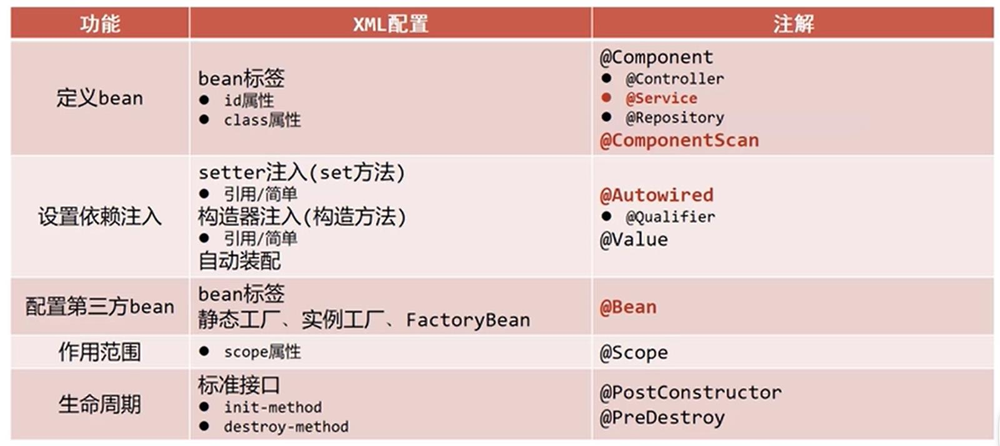

## spring__xml和注解配置对比
.   
<>
## spring使用第三方Bean
.   [1-1 编写第三方的类](./main/java/hui/config/JdbcConfig.java)
.   [1-2 在springConfig配置类中使用@Import(JdbcConfig.class)引入第三方的类](./main/java/hui/config/SpringConfig.java)
.   [1-3 第三方的类中方法添加@bean注解](./main/java/hui/config/JdbcConfig.java)

    内容:
        1. 第三方Bean管理:
            一般使用独立的配置类管理第三方bean
        2. @Import({JdbcConfig.class})注解
            @Import注解在一个类中只能出现一次, 引入多个配置类需要使用数组格式

## 第三方bean的依赖注入
.   [1-5 JdbcConfig中注入基本数据类型数据](./main/java/hui/config/JdbcConfig.java)
.   [1-6 JdbcConfig中注入引用数据类型数据](./main/java/hui/config/JdbcConfig.java)
    
    内容:
        引入基本数据类型：
            使用@Value("test")注解
        引入引用数据类型：
            直接为Bean设置形参， 容器会自动根据类型自动装配对象　
        
    
      
        
